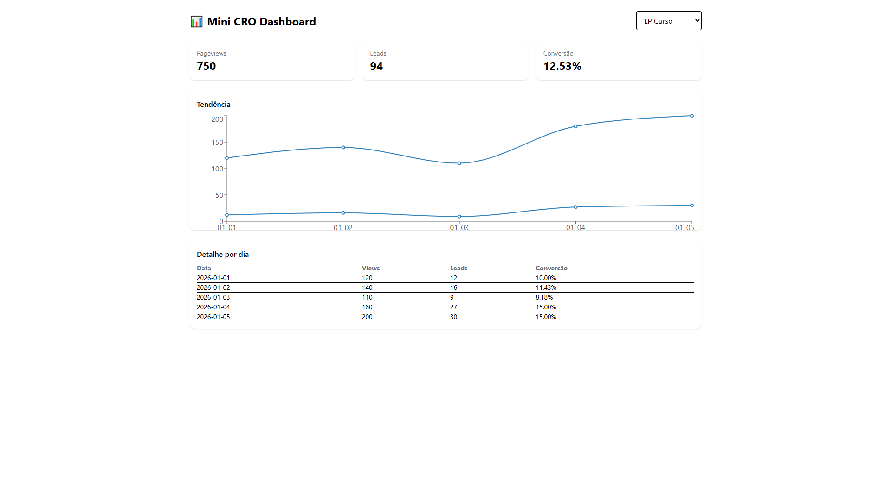

# 📊 Mini CRO Dashboard

Dashboard de análise de performance de landing pages focado em métricas de conversão (CRO - Conversion Rate Optimization).

Este projeto simula um painel usado por times de marketing e produto para analisar resultados de páginas e tomar decisões baseadas em dados.

---

## 🎯 Objetivo

Demonstrar:

* Leitura e visualização de métricas
* Cálculo de conversão
* Organização de dados
* UI limpa e objetiva
* Raciocínio orientado a negócio e produto

---

## 🧠 Métricas exibidas

* Pageviews
* Leads
* Taxa de conversão (%)
* Comparação entre páginas
* Filtro por período
* Gráfico de evolução (mock)

---

## 📸 Preview



---

## 🧱 Stack

* React
* TypeScript
* Vite
* Tailwind CSS
* Dados mockados (simulação de API)

---

## 📂 Estrutura do projeto

```
src/
 ├── data/        # Dados mockados
 ├── components/  # Componentes reutilizáveis
 ├── pages/       # Páginas
 └── App.tsx
```

---

## 🚀 Como rodar o projeto

```bash
npm install
npm run dev
```

Acesse:

```
http://localhost:5173
```

---

## 📈 Ideias de evolução futura

* Conectar com API real
* Exportar relatório em PDF/CSV
* Comparar períodos
* Autenticação
* Modo dark

---

## 🖼️ Ícone do projeto

Sugestão de ícone:

* chart-line
* dashboard
* analytics

Sites para pegar ícones:

* [https://lucide.dev/icons](https://lucide.dev/icons)
* [https://heroicons.com](https://heroicons.com)
* [https://tabler-icons.io](https://tabler-icons.io)

---

## 👤 Autor

Tony Souza
🔗 LinkedIn: [https://www.linkedin.com/in/souztony/](https://www.linkedin.com/in/souztony/)
💻 GitHub: [https://github.com/souztony](https://github.com/souztony)
